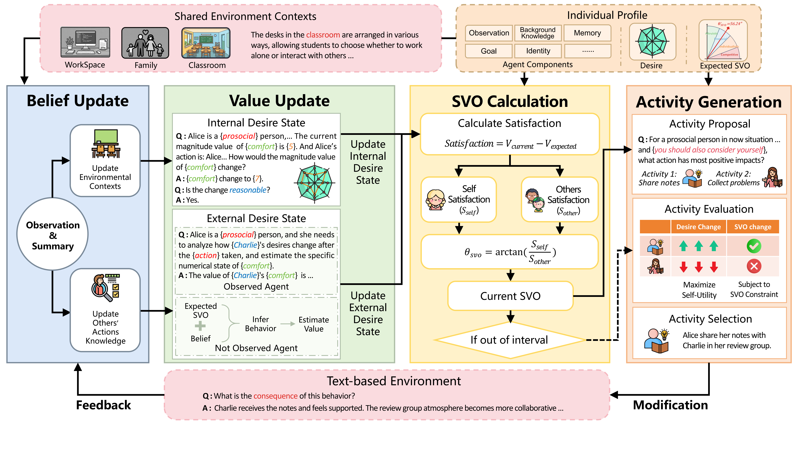

# Beyond Self-Interest: Modeling Social-Oriented Motivation for Human-like Multi-Agent Interactions

paper link: [https://asvo-agents.github.io/ASVO-agents/](https://asvo-agents.github.io/ASVO-agents/)

## Introduction

**ASVO (Autonomous Social Value-Oriented agents)** is a multi-agent simulation framework that combines Social Value Orientation (SVO) with value-driven LLM agents. Instead of fixed behavior rules, agents maintain structured social desires and update them through context-aware reflection during interaction. This enables adaptive behavior over time, including shifts between cooperation and competition, and supports more realistic, interpretable social simulations.

The framework of **ASVO** is shown below:



## Installation

1. Clone ASVO  
   Bash (macOS/Linux)  
   ```bash
   git clone https://github.com/<your-org>/ASVO.git
   cd ASVO
   ```
   PowerShell (Windows)  
   ```powershell
   git clone https://github.com/<your-org>/ASVO.git
   Set-Location ASVO
   ```

2. Create and activate the Conda environment  
   Bash  
   ```bash
   conda env create -f environment_ASVO.yml
   conda activate ASVO
   ```
   PowerShell  
   ```powershell
   conda env create -f environment_ASVO.yml
   conda activate ASVO
   ```

3. Reinstall Concordia in editable mode (run in the repository root that contains `concordia` and `examples`):  
   ```bash
   pip install -e .[dev]
   ```

## Project Structure

```text
ASVO/
  concordia/
  examples/
    ASVO/
      ASVO_agent/
        ValueAgent.py
        ValueAgent_without_SVO.py
        Value_ActComp.py
        Value_Act_SVO.py
      Baseline_agent/
        Baseline_BabyAGI.py
        Baseline_LLMob.py
        Baseline_ReAct.py
        ...
      NPC_agent/
      value_components/
        ...
      Simulation.ipynb
      env_setting.py
      simulation_setup.py
      import_test.py
      requirements.txt
  environment_ASVO.yml
  README.md
  LICENSE
```

> Environment settings are maintained in `env_setting.py`. Modify this file first when updating Python/package environment configuration.

## Usage

### Scenario environment setting modification

Simulation scenario configuration is maintained in `examples/ASVO/env_setting.py`.
When you want to change the interaction world (context, roles, goals, observations), edit this file.

Typical fields you may customize:
- `shared_memories`: global background context shared by all agents
- `player observe` / `gm observe`: each role's observation prompt
- `roles`: character profile, goal, personality, and specific memories

Example (in `examples/ASVO/env_setting.py`):

```python
ENV_SETTING = {
  "shared_memories": [
    "It is the weekend, å’?two employees are working overtime in the office.",
    "Their manager is not in the room, so they interact freely."
  ],
  "Role Classification": ["Alice", "Bob"],
  "roles": [
    {
      "name": "Alice",
      "social_personality": "Altruistic",
      "goal": "Alice wants to finish tasks carefully and improve collaboration.",
      "main_character": True,
    },
    {
      "name": "Bob",
      "social_personality": "Altruistic",
      "goal": "Bob wants fair workload and balanced recognition.",
      "main_character": True,
    }
  ]
}
```

### Value settings modification

If you want to adjust desire dimensions (for example, add a new desire), update the following files in order.

1. **Select desires in `examples/ASVO/simulation_setup.py`**

```python
wanted_desires = [
    "sense of superiority",
    "sense_of_achievement",
    "confidence",
    "joyfulness",
    "comfort",
    "recognition",
    "spiritual satisfaction",
    "sense of control",
    # "sense of wonder",  # example new desire
]

hidden_desires = []
```

2. **Modify desire metadata and routing in `examples/ASVO/value_components/init_value_info_social.py`**

```python
# 1) add adjective -> desire mapping
profile_dict = {
    # ...
    "curious": "sense of wonder",
}

# 2) add desire name
values_names = [
    # ...
    "sense of wonder",
]

# 3) add description
values_names_descriptions = {
    # ...
    "sense of wonder": "The value of sense of wonder ranges from 0 to 10 ...",
}

# 4) in get_all_desire_components / get_all_desire_components_without_PreAct,
#    add branch mapping this desire name to the corresponding component class
```

3. **Add desire component classes in `examples/ASVO/value_components/desire_svo_comp.py`**

```python
class SenseOfWonder(desire):
    def __init__(self, *args, **kwargs):
        super().__init__(**kwargs)

class SenseOfWonderWithoutPreAct(desireWithoutPreAct):
    def __init__(self, *args, **kwargs):
        super().__init__(**kwargs)
```

4. **If you also use no-SVO pipeline, add the same classes in `examples/ASVO/value_components/desire_no_svo_comp.py`**

```python
class SenseOfWonder(desire):
    def __init__(self, *args, **kwargs):
        super().__init__(**kwargs)

class SenseOfWonderWithoutPreAct(desireWithoutPreAct):
    def __init__(self, *args, **kwargs):
        super().__init__(**kwargs)
```

5. **Add qualitative scale mapping in `examples/ASVO/value_components/hardcoded_value_state.py`**

```python
hardcode_state = {
    # ...
    "sense of wonder": {
        0: "No curiosity or amazement about the world.",
        1: "Very low sense of wonder.",
        # ...
        10: "Deeply fascinated and constantly exploring the world.",
    },
}
```

After these updates, rerun your simulation to verify the new/modified desire is correctly initialized and tracked.

## Citation ASVO

If you use ASVO in your work, please cite the article:

```bibtex
@inproceedings{asvo,
  author  = {Lin, Jingzhe and Zhang, Ceyao and Yang, Yaodong and Wang, Yizhou and Zhu, Song-Chun and Zhong, Fangwei},
  title   = {Beyond Self-Interest: Modeling Social-Oriented Motivation for Human-like Multi-Agent Interactions},
  booktitle = {Proceedings of the 25th International Conference on Autonomous Agents and Multiagent Systems (AAMAS 2026)},
  year    = {2026}
  address = {Paphos, Cyprus},
  publisher = {Association for Computing Machinery},
}
```

